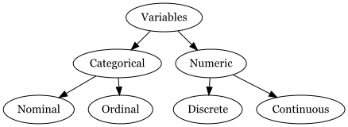

```{r}
#| echo: false
library(openintro)
library(tidyverse)
library(palmerpenguins)
library(fGarch) # for simulating skewed data

theme_set(theme_gray(base_size = 22))

babies <- babies %>% 
  mutate(
    smoke = as.logical(smoke),
    parity = as.logical(parity)
  )
```


##

```{r}
#| echo: false

```


## Data

```{r}
glimpse(babies)
```

##

```{r}
#| eval: false
?babies
```

`case` id number

`bwt` birthweight, in ounces

`gestation` length of gestation, in days

`parity` binary indicator for a first pregnancy (0 = first pregnancy)

`age` mother's age in years

`height` mother's height in inches

`weight` mother's weight in pounds

`smoke` binary indicator for whether the mother smokes


# Summary stats for categorical variables

Counts and proportions

```{r}
library(janitor)
tabyl(babies, smoke)
```
# Summary stats for numeric variable

## Mean


```{r}
summarize(babies, mean(bwt))
```

```{r}
mean(babies$bwt)
```

## Mean with missing values


```{r}
summarize(babies, mean(bwt, na.rm = TRUE))
```

```{r}
mean(babies$bwt, na.rm = TRUE)
```


## Median


```{r}
summarize(babies, median(bwt))
```


```{r}
median(babies$bwt)
```


## Minimum

```{r}
summarize(babies, min(bwt))
```


```{r}
min(babies$bwt)
```

In a similar fashion maxiumum can be found by using the `max()` function.

## Standard deviation


```{r}
summarize(babies, sd(bwt))
```


```{r}
sd(babies$bwt)
```


## Variance

```{r}
summarize(babies, var(bwt))
```


```{r}
var(babies$bwt)
```

## We can compute multiple summary statistics at once

```{r}
summarize(babies, mean(bwt), sd(bwt), mean(age, na.rm = TRUE))
```

## We can even look at summary statistics for different groups

```{r}
group_by(babies, smoke) |> 
summarize(mean(bwt))
```

The pipe symbol "|>" essentially carries what was on that line into the next function.

Notice I did not have to provide babies as the first argument to `summarize()`.

## Data Visualizations

- are graphical representations of data

- use different colors, shapes, and the coordinate system to summarize data

- can tell a story or can be useful for exploring data

## Bar plot

```{r}
#| echo: false
#| fig-align: center
ggplot(babies, aes(x = smoke)) +
  geom_bar()
```

## Bar plot

```{r}
#| output-location: column
ggplot(babies)
```

## Bar plot

```{r}
#| output-location: column
ggplot(babies, aes(x = smoke)) 
```

## Bar plot

```{r}
#| output-location: column
ggplot(babies, aes(x = smoke)) +
  geom_bar()
```

## Bar plot

```{r}
#| output-location: column

filter(babies, !is.na(smoke)) |> 
ggplot(aes(x = smoke)) +
  geom_bar()
```

## Histogram

```{r}
#| echo: false
#| fig-align: center
ggplot(babies, aes(x = bwt)) +
  geom_histogram()
```

## Histogram

```{r}
#| output-location: column
ggplot(babies)
```

## Histogram

```{r}
#| output-location: column
ggplot(babies, aes(x = bwt))
```

## Histogram

```{r}
#| output-location: column
ggplot(babies, aes(x = bwt)) +
  geom_histogram()
```


## Binwidth

```{r}
ggplot(babies, aes(x = bwt)) +
  geom_histogram(binwidth = 3, color = "green")
```

##

```{r}
#| echo: false
#| message: false
#| warning: false
#| fig.height: 6
#| cache: true
set.seed(12345)

symmetric <- rnorm(n = 10000, mean = 0, sd = 1)

right_skewed <- rsnorm(n = 10000, mean = 0, sd = 1, xi = 20)

left_skewed <- rsnorm(n = 10000, mean = 0, sd = 1, xi = -20)

type <- c(
  rep("left-skewed", 10000),
  rep("symmetric", 10000),
  rep("right-skewed", 10000)
)

x <- c(left_skewed, symmetric, right_skewed)

data <- tibble(x = x, type = type)

```

::::{.columns}

:::{.column width="50%"}

```{r}
#| echo: false
data %>% 
  filter(type == "left-skewed") %>% 
  ggplot(aes(x = x)) +
  geom_histogram() +
  labs(title = "Left skewed") +
  theme_classic(base_size = 22) 
```

:::

:::{.column width="50%"}

```{r}
#| echo: false
data %>% 
  filter(type == "symmetric") %>% 
  ggplot(aes(x = x)) +
  geom_histogram() +
  labs(title = "Symmetric") +
  theme_classic(base_size = 22)
```
:::

:::{.column width="50%"}

```{r}
#| echo: false
data %>% 
  filter(type == "right-skewed") %>% 
  ggplot(aes(x = x)) +
  geom_histogram() +
  labs(title = "Right skewed") +
  theme_classic(base_size = 22)
```

:::

::::

When data display a skewed distribution we rely on median rather than the mean to understand the center of the distribution.


## Looking at Relationships

So far we seen bar plots and histograms both of which are useful for visualizing a single categorical and numerical variables respectively. 

. . .

We are often interested in looking at relationships between two variables. 
We have statistical tests to examine such relationships. 
However, visualizations can often help us explore if such relationships are worth looking into. 

## Standardized Bar Plots

```{r}
#| output-location: column
#| fig-align: center
ggplot(
  data = babies,
  aes(x = smoke, fill = parity)
) + 
  geom_bar(position = "fill")
```

## Standardized Bar Plots

```{r}
#| output-location: column
#| fig-align: center
ggplot(
  data = babies,
  aes(x = smoke, fill = parity)
) + 
  geom_bar(position = "fill") +
  labs(
    x = "Smoke",
    y = "Proportion",
    fill = "First pregnancy"
  )
```

## Dodged Bar Plot

```{r}
#| output-location: column
#| fig-align: center
ggplot(
  data = babies,
  aes(x = smoke, fill = parity)
) + 
  geom_bar(position = "dodge")
```

## Side-by-Side Boxplots

```{r}
#| output-location: column
#| fig-align: center
ggplot(
  babies,
  aes(x = smoke, y = bwt))  +
  geom_boxplot() 
```

## Understanding Each Box


::::{.columns}

:::{.column width="50%"}

```{r}
#| echo: false
ggplot(babies, aes(y = bwt)) +
  geom_boxplot() +
  scale_x_discrete() +
  ylab("Birth Weight") +
  xlab("") 
```


:::

:::{.column width="50%"}

- The horizontal line in the box represents the median.
- The box represents the middle 50% of the data with Q3 on the upper end and Q1 on the lower end. 

:::

::::

## Understanding Each Box


::::{.columns}

:::{.column width="50%"}

```{r}
#| echo: false
ggplot(babies, aes(y = bwt)) +
  geom_boxplot() +
  scale_x_discrete() +
  ylab("Birth Weight") +
  xlab("") 
```

:::

:::{.column width="50%"}


- Whiskers extend from the box. They can extend up to 1.5 IQR away from the box (i.e. away from Q1 and Q3). 
- The points are potential outliers that represent babies with really low or high birth weight.

:::

::::

## Scatter plots

```{r}
#| output-location: column
#| fig-align: center
ggplot(
  babies,
  aes(x = gestation, y = bwt)
)  +
  geom_point()
```

Length of gestation can **possibly** eXplain a baby's birth weight. 
Gestation is the eXplanatory variable and is shown on the x-axis.
Birth weight is the response variable and is shown on the y-axis.

---

## Linear Relationship

```{r echo = FALSE, fig.height=4, fig.align='center', warning=FALSE, message=FALSE}
ggplot(
  babies,
  aes(x = gestation, y = bwt))  +
  geom_point() +
  labs(
    x = "Gestation (days)",
    y = "Birth weight (ounces)"
  ) +
  geom_smooth(method = "lm", se = FALSE)
```

Next we will start statistical modeling during which we will numerically define the relationship between gestation and birth weight. 
For now we can say that this relationship looks positive and moderate.


## Meet Palmer Penguins[^1]


```{r}
#| echo: false
#| fig-align: center
knitr::include_graphics("img/penguins.png")
```


[^1]: Penguin artworks by @allison_horst.

##

```{r}
#| echo: false
#| fig-align: center
knitr::include_graphics("img/penguin_bill.png")
```

## Data


```{r}
glimpse(penguins)
```

## Visualizing Three Variables

```{r}
#| fig-align: center
ggplot(penguins, aes(x = body_mass_g, y = bill_length_mm, color = species)) +
  geom_point()
```

We can use color to consider a third variable

## Visualizing Three Variables

```{r}
#| fig-align: center
ggplot(penguins, aes(x = body_mass_g, y = bill_length_mm, shape = species)) +
  geom_point(size = 3)
```

We can even use shapes

## Visualizing Three Variables

```{r}
#| fig-align: center
ggplot(penguins, aes(x = body_mass_g, y = bill_length_mm, shape = species, color = species)) +
  geom_point(size = 3)
```

In case someone has a visual impairment we can use both

## Plots by data scenario

::::{.columns}

:::{.column width="50%"}
**Single categorical variable**

- bar plots

**Single numeric variable**

- histogram
- boxplot
:::

:::{.column width="50%"}
**Two categorical variables**

- standardized bar plot
- dodged bar plot

**Two numeric variables**

- scatter plot

:::

::::

**Two numeric one categorical**

- scatter plot with color/shape


## Themes

::: {.panel-tabset}
## `theme_gray()`

```{r}
#| code-line-numbers: "15"
#| output-location: column
#| fig-width: 6
#| fig-height: 4
ggplot(
  penguins,
  aes(
    x = bill_depth_mm,
    y = bill_length_mm,
    color = species
  )
) +
  geom_point() +
  labs(
    x = "Bill Depth (mm)", 
    y = "Bill Length (mm)", 
    title = "Palmer Penguins"
) +
  theme_gray()
```

Theme gray is the default theme in ggplot.

## `theme_bw()`

```{r}
#| code-line-numbers: "15"
#| output-location: column
#| fig-width: 6
#| fig-height: 4
ggplot(
  penguins,
  aes(
    x = bill_depth_mm,
    y = bill_length_mm,
    color = species
  )
) +
  geom_point() +
  labs(
    x = "Bill Depth (mm)", 
    y = "Bill Length (mm)", 
    title = "Palmer Penguins"
) +
  theme_bw()
```

## `theme_dark()`

```{r}
#| code-line-numbers: "15"
#| output-location: column
#| fig-width: 6
#| fig-height: 4
ggplot(
  penguins,
  aes(
    x = bill_depth_mm,
    y = bill_length_mm,
    color = species
  )
) +
  geom_point() +
  labs(
    x = "Bill Depth (mm)", 
    y = "Bill Length (mm)", 
    title = "Palmer Penguins"
) +
  theme_dark()
```


## `theme_classic()`

```{r}
#| code-line-numbers: "15"
#| output-location: column
#| fig-width: 6
#| fig-height: 4
ggplot(
  penguins,
  aes(
    x = bill_depth_mm,
    y = bill_length_mm,
    color = species
  )
) +
  geom_point() +
  labs(
    x = "Bill Depth (mm)", 
    y = "Bill Length (mm)", 
    title = "Palmer Penguins"
) +
  theme_classic()
```


## `theme_minimal()`


```{r}
#| code-line-numbers: "15"
#| output-location: column
#| fig-width: 6
#| fig-height: 4
ggplot(
  penguins,
  aes(
    x = bill_depth_mm,
    y = bill_length_mm,
    color = species
  )
) +
  geom_point() +
  labs(
    x = "Bill Depth (mm)", 
    y = "Bill Length (mm)", 
    title = "Palmer Penguins"
) +
  theme_minimal()
```


:::