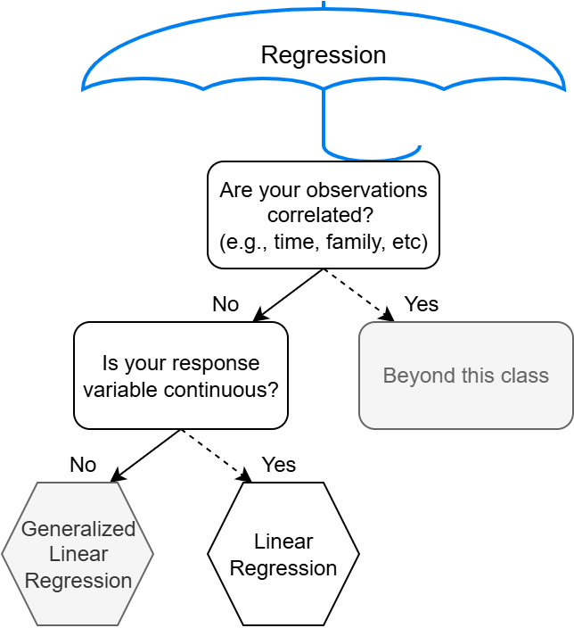

```{r}
#| echo: false

library(tidyverse)
library(janitor)
```

## 

{fig-align="center"}


## 

**Simple linear regression** involves regressing $Y$ on only one $X$

$$Y_i = \beta_0 + \beta_1 X_i + \epsilon_i,$$

with $\epsilon_i \overset{iid}{\sim} N(0, \sigma^2)$.

**Multiple linear regression** involves regressing $Y$ on multiple $X$'s

$$Y_i = \beta_0 + \beta_1 X_{1i} + \beta_2 X_{2i} + ... + \beta_p X_{pi} + \epsilon_i.$$

. . .

*Why would we want multiple* $X$'s?


## Motivating example: Loan data

This dataset represents thousands of loans made through the Lending Club platform, which is a platform that allows individuals to lend to other individuals.

```{r}
library(openintro)

data("loans_full_schema")

# Data wrangling and saving clean data into `loans`
loans <- loans_full_schema |> 
  mutate(bankruptcy = public_record_bankrupt != 0) |> 
  mutate(credit_util = total_credit_utilized / total_credit_limit)
```


## Motivating example: Loan data

You can type `? loans_full_schema` into Console for the full data documentation.

```{r}
glimpse(loans)
```

## Motivating example: Loan data

- `interest_rate`	Interest rate on the loan, in an annual percentage.
- `bankruptcy`	An indicator variable for whether the borrower has a past bankruptcy in their record. This variable takes a value of `1` if the answer is *yes* and `0` if the answer is *no*.
- `verified_income`	Categorical variable describing whether the borrower's income source and amount have been verified, with levels `Verified` (source and amount verified), `Source Verified` (source only verified), and `Not Verified`.


<!-- ## Motivating example: Loan data -->

<!-- - `credit_util`	Of all the credit available to the borrower, what fraction are they utilizing. For example, the credit utilization on a credit card would be the card's balance divided by the card's credit limit. -->
<!-- - `debt_to_income`	Debt-to-income ratio, which is the percentage of total debt of the borrower divided by their total income. -->
<!-- - `term`	The length of the loan, in months. -->

<!-- ## Motivating example: Loan data -->

<!-- - `issue_month`	The month and year the loan was issued, which for these loans is always during the first quarter of 2018. -->
<!-- - `credit_checks`	Number of credit checks in the last 12 months. For example, when filing an application for a credit card, it is common for the company receiving the application to run a credit check. -->


# Categorical explanatory variables (aka Categorical "predictors" or Categorical "features")

## Regressing interest rate on bankruptcy

```{r}
count(loans, bankruptcy)
```

```{r}
ggplot(loans, aes(x = bankruptcy, y = interest_rate)) +
  geom_boxplot()
```


## Regressing interest rate on bankruptcy

```{r}
rate_on_bankruptcy_model <- lm(interest_rate ~ bankruptcy, data = loans)

summary(rate_on_bankruptcy_model)
```
. . .

*How do we interpret the slope? What does it mean to be one unit more for X?*


## Regressing interest rate on bankruptcy: Fitted model

```{r}
library(broom)

tidy(rate_on_bankruptcy_model)
```

```{r}
#| echo: false

beta0_hat <- round(rate_on_bankruptcy_model$coefficients["(Intercept)"], digits = 2)
beta1_hat <- round(rate_on_bankruptcy_model$coefficients["bankruptcyTRUE"], digits = 2)
```


$\hat{\text{Interest rate}}_i$ = `r beta0_hat` 

$+$ `r beta1_hat` * $I(\text{Bankruptcy}_i = \text{TRUE})$

##  Regressing interest rate on bankruptcy: Interpreting coefficients

$\hat{\text{Interest rate}}_i$ = `r beta0_hat` 

$+$ `r beta1_hat` * $I(\text{Bankruptcy}_i = \text{TRUE})$

. . .


Definition:

$I(\text{Bankruptcy}_i = \text{TRUE})$ is an indicator variable. 

- It will be equal to 0 if the condition is not met
- It will be equal to 1 if the condition is met


## Regressing interest rate on bankruptcy: Interpreting coefficients

$\hat{\text{Interest rate}}_i$ = `r beta0_hat` 

$+$ `r beta1_hat` * $I(\text{Bankruptcy}_i = \text{TRUE})$

. . .


- Expected interest rate for people with no bankruptcy on their record is `r beta0_hat`.

- Expected interest rate for people with at least one bankruptcy on their record is `r beta0_hat + beta1_hat`.

. . .

- The model predicts a `r beta1_hat`% higher interest rate for borrowers with a bankruptcy on their record.

## Regressing interest rate on bankruptcy

```{r}
#| echo: false

data.frame(
  type = c("No bankruptcy", "Bankruptcy"),
  expected_rate = c(beta0_hat, beta0_hat + beta1_hat),
  x = c(0, 1)
) |>
ggplot() +
  geom_hline(aes(yintercept = expected_rate, color = type), linewidth = 2) +
  labs(x = " ", y = "Expected interest rate", color = " ") +
  theme_bw()
```


## t-test versus regression

```{r}
interest_rate_bankruptcy_false <- loans |> 
  filter(bankruptcy == FALSE) |> 
  pull(interest_rate)

interest_rate_bankruptcy_true <- loans |> 
  filter(bankruptcy == TRUE) |> 
  pull(interest_rate)

t.test(interest_rate_bankruptcy_false, interest_rate_bankruptcy_true)
```


## t-test versus regression

```{r}
t.test(interest_rate_bankruptcy_false, interest_rate_bankruptcy_true)
```

. . .

```{r}
tidy(rate_on_bankruptcy_model)
```

. . .

They are the same!

## Regressing on categorical predictors

That was a continuous variable regression on a categorical variable with two levels (possibilities).

- Equivalent to a t-test.
- Our regression line is really two flat lines (means)

What if we regressed on a categorical variable with three or more levels (possibilities)?


## Regressing interest rate on verified income

Notice that the `verified_income` variable is categorical with three levels

```{r}
count(loans, verified_income)
```


##

```{r}
ggplot(loans, aes(x = verified_income, y = interest_rate)) +
  geom_boxplot()
```


## Regressing interest rate on verified income

```{r}
rate_on_verification <- lm(interest_rate ~ verified_income, data = loans)

summary(rate_on_verification)
```

## Fitted interest rate model: Fitted model

```{r}
#| echo: false

beta0_hat <- round(rate_on_verification$coefficients["(Intercept)"], 2)

beta1_hat <- round(rate_on_verification$coefficients["verified_incomeSource Verified"], 2)

beta2_hat <- round(rate_on_verification$coefficients["verified_incomeVerified"], 2)
```


```{r}
broom::tidy(rate_on_verification)
```


Our model appears to be 

$\hat{\text{Interest rate}}_i$ =`r beta0_hat` 

\+ `r beta1_hat` $I(\text{verified_income}_i = \text{Source Verified})$

\+ `r beta2_hat` $I(\text{verified_income}_i = \text{Verified}).$

. . .

*Is anything missing?*


## Categorical predictors

When fitting a regression model with a categorical variable that has $k$ levels where $k \geq  2$, software will provide a coefficient for $k-1$ of those levels. 

- For the last level that does not receive a coefficient, this is the **reference level**, and the coefficients listed for the other levels are all considered relative to this reference level.


## Expected difference in interest ratec

$\hat{\text{Interest rate}}_i$ =`r beta0_hat` 

\+ `r beta1_hat` $I(\text{verified_income}_i = \text{Source Verified})$

\+ `r beta2_hat` $I(\text{verified_income}_i = \text{Verified}).$

- We expect a `r beta1_hat`% higher interest rate for people source only verified relative to unverified people.
- We expect a `r beta2_hat`% higher interest rate for people source and amount verified relative to unverified people.


## Expected interest rate

$\hat{\text{Interest rate}}_i$ =`r beta0_hat` 

\+ `r beta1_hat` $I(\text{verified_income}_i = \text{Source Verified})$

\+ `r beta2_hat` $I(\text{verified_income}_i = \text{Verified}).$

- Expected interest rate for people not verified is `r beta0_hat`.

- Expected interest rate for people source only verified is `r beta0_hat + beta1_hat`.

- Expected interest rate for people source and amount verified is `r beta0_hat + beta1_hat + beta2_hat`.


## Expected interest rate

```{r}
#| echo: false

data.frame(
  type = c("Not verified", "Source verified", "Verified"),
  expected_rate = c(beta0_hat, beta0_hat + beta1_hat, beta0_hat + beta1_hat + beta2_hat),
  x = c(0, 1, 2)
) |>
ggplot() +
  geom_hline(aes(yintercept = expected_rate, color = type), linewidth = 2) +
  labs(x = "", y = "Expected interest rate", color = "") +
  theme_bw()
```


## Converting categorical variables to numeric in regression

*Why shouldn't we just convert the `verified_income` variable to a numeric?*

. . .


```{r}
loans <- loans |> 
  mutate(verified_income_numeric = case_when(
    verified_income == "Not Verified" ~ 0,
    verified_income == "Source Verified" ~ 1,
    verified_income == "Verified" ~ 2
  ))
```


## Converting categorical variables to numeric in regression

```{r}
rate_on_ver_num_model <- lm(interest_rate ~ verified_income_numeric, data = loans)

summary(rate_on_ver_num_model)
```


## Converting categorical variables to numeric in regression

$\hat{\beta_1} = 1.61$

By converting we are implicitly assuming that there is a one unit difference between each of the levels:

- Not verified -> Source only verified
- Source only verified -> Source and amount verified

. . .

This may not be the case, maybe "Source only verified" and "Source and amount verified" are more similar than "Not verified"

. . .

**Not good practice!**


# Multiple predictors of different variable types

## Regressing interest rate on bankruptcy and credit lines

```{r}
ggplot(loans, aes(x = total_credit_lines, y = interest_rate, color = bankruptcy)) +
  geom_point()
```


## Regressing interest rate on bankruptcy and credit lines

```{r}
rate_on_bank_and_credit_model <- lm(interest_rate ~ bankruptcy + total_credit_lines, data = loans)

summary(rate_on_bank_and_credit_model)
```


## Regressing interest rate on bankruptcy and credit lines

```{r}
tidy(rate_on_bank_and_credit_model)
```

```{r}
#| echo: false

beta0_hat <- round(rate_on_bank_and_credit_model$coefficients["(Intercept)"], digits = 2)
beta1_hat <- round(rate_on_bank_and_credit_model$coefficients["bankruptcyTRUE"], digits = 2)
beta2_hat <- round(rate_on_bank_and_credit_model$coefficients["total_credit_lines"], digits = 2)
```

$\hat{\text{Interest rate}}_i$ = `r beta0_hat` 

$+$ `r beta1_hat` $I(\text{Banruptcy_i = TRUE})$ 

$+$ `r beta2_hat` $\text{Number credit lines}_i$

## Interpreting estimates

$\hat{\text{Interest rate}}_i$ = `r beta0_hat` 

$+$ `r beta1_hat` $I(\text{Banruptcy_i = TRUE})$ 

$+$ `r beta2_hat` $\text{Number credit lines}_i$

- We expect an interest rate of `r beta0_hat` for people with no bankruptcy and no lines of credit.


## Interpreting estimates

$\hat{\text{Interest rate}}_i$ = `r beta0_hat` 

$+$ `r beta1_hat` $I(\text{Banruptcy_i = TRUE})$ 

$+$ `r beta2_hat` $\text{Number credit lines}_i$

We interpret a slope *with all other variables fixed*:

- We expect a `r beta1_hat`% higher interest rate for borrowers with a bankruptcy on their record, for people with similar number of lines of credit.
- We expect a `r abs(beta2_hat)`% decrease in interest rate associated with having one additional line of credit, for people with the same bankruptcy history.


## Regressing interest rate on bankruptcy and credit lines

```{r}
ggplot(loans, aes(x = total_credit_lines, y = interest_rate, color = bankruptcy)) +
  geom_point() +
  geom_smooth(method = "lm", se = FALSE)
```
