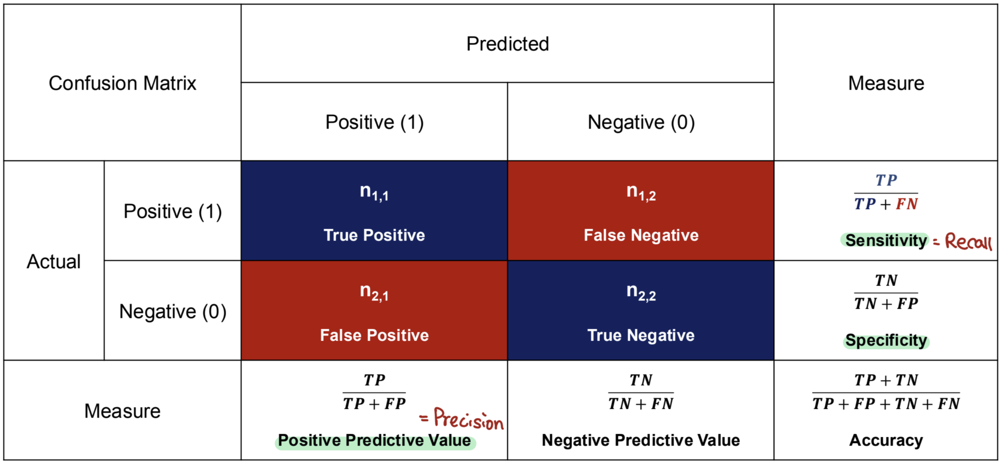

```{r}
#| echo: false

library(tidyverse)
library(janitor)
```

## Logisitic regression

$$\log\left(\frac{E[Y_i | X_{1i}, ..., X_{pi}]}{1 - E[Y_i | X_{1i}, ..., X_{pi}]}\right) = \beta_0 + \beta_1 X_{1i} + ... + \beta_p X_{pi}$$

We often let $\pi_i = E[Y_i | X_{1i}, ..., X_{pi}]$ so our model is written

$$\log\left(\frac{\pi_i}{1 - \pi_i}\right) = \beta_0 + \beta_1 X_{1i} + ... + \beta_p X_{pi}$$

# Interpreting coefficients

##

$\beta_0$ is the log odds for when all $X_i$'s are zero.

## 

$\beta_1$ is the log odds ratio associated with a one unit increase in $X_1$

- $exp(\beta_1)$ is the odds ratio associated with a one unit increase in $X_1$
- $exp(\beta_1)$ is the multiplicative decrease / factor decrease in odds associated with a one unit increase in $X_i$
- For $exp(\beta_1)>1$, $100 * (exp(\beta_1) - 1)$% is the increase in in odds associated with a one unit increase in $X_1$. If $exp(\beta_1)>1$, it would be the $100 * (1 - exp(\beta_1))$% decrease

... with all other $X_i$'s held constant.

# Inference

In our class we will focus on two methods for hypothesis tests and confidence intervals

- Wald
- Likelihood ratio

## Comparing inference methods

::::{.columns}
:::{.column width="50%"}
**Wald** - For a single predictor

- Pro: Easy to calculate
- Pro: Only requires fitting one model
- Con: Invalid for small sample size
- Con: Confidence intervals may contain invalid values outside [0,1]

:::

:::{.column width="50%"}
Likelihood ratio - similar to partial F / F-test for linear regression

:::
::::


## Comparing inference methods

::::{.columns}
:::{.column width="50%"}
**Wald** - For a single predictor

- Pro: Easy to calculate
- Pro: Only requires fitting one model
- Con: Invalid for small sample size
- Con: Confidence intervals may contain invalid values outside [0,1]

:::

:::{.column width="50%"}
**Likelihood ratio** - Compares nested models
  
- Pro: Confidence intervals will only contain valid values
- Pro: Not invalidated by small sample size
- Con: Requires fitting two models
- Con: Not as easy to fit, bounds require optimization algorithm 

:::
::::

## Coronary heart disease (cdh) data

A retrospective sample of males in a heart-disease high-risk region of the Western Cape, South Africa. 
These data are taken from a larger dataset, described in  Rousseauw et al, 1983, South African Medical Journal.


## 

- `sbp`		systolic blood pressure
- `tobacco`		cumulative tobacco (kg)
- `ldl`		low density lipoprotein cholesterol
- `adiposity` body fat
- `famhist`		family history of heart disease
- `typea`		type-A behavior
- `obesity` 
- `alcohol`		current alcohol consumption
- `age`		age at onset

##

```{r}
heart_data <- read_csv(
  "https://hastie.su.domains/ElemStatLearn/datasets/SAheart.data", 
  show_col_types = FALSE
)

glimpse(heart_data)
```

## Fitting the model

\begin{equation*}
  \begin{split}
    \log(\frac{\pi_i}{1 - \pi_i}) &= \beta_0 + \beta_1 X_{\text{Blood pressure}, i}\\
    &+ \beta_2 X_{\text{Family history}, i} + \beta_1 X_{\text{Age}, i}
  \end{split}
\end{equation*}

```{r}
heart_model <- glm(
  chd ~ sbp + famhist + age,
  data = heart_data,
  family = binomial # This tells it to do logisitic regression
)
```

##

```{r}
summary(heart_model)
```

# Testing example 1

Let's test if systolic blood pressure should be in the model

$H_0: \beta_1 = 0$

$H_A: \beta_1 \neq 0$

We can do this with a Wald or Likelihood ratio test

```{r}
heart_full_model <- glm(
  chd ~ sbp + famhist + age,
  data = heart_data,
  family = binomial # This tells it to do logisitic regression
)
```


## Performing Wald Test

```{r}
summary(heart_full_model)
```

*The `summary()` function displays Wald Statistics.*

## Performing Likelihood Ratio Tests

```{r}
heart_reduced_model <- glm(
  chd ~ famhist + age,
  data = heart_data,
  family = binomial # This tells it to do logisitic regression
)

anova(heart_reduced_model, heart_full_model, test = "LRT")
```

## 

- The p-value for Wald test: 0.235
- The p-value for the Likelihood Ratio Test: 0.2344
- The two p-values won't necessarily equal the same. In practice you would choose one test to perform, you wouldn't fit both.

A probability of 0.02344 is not unlikely, so fail to reject $H_0$.

We found no evidence (Likelihood ratio test p-value = 0.2344) that the model with systolic blood pressure significantly improves the fit compared to the model with just family history and age.

# Testing example 2

Let's test if systolic blood pressure and family history should be in the model

$H_0: \beta_1 = 0 & \beta_2 = 0$

$H_A:$ At least one of $\beta_1$ or $\beta_2$ are zero

We can do this with a Wald or Likelihood ratio test


## Wald test

```{r}
library(aod)

wald.test(
  Sigma = vcov(heart_full_model), 
  b = coef(heart_full_model), 
  Terms = c(1, 2)
)
```


## Likelihood ratio test
```{r}
heart_reduced_model2 <- glm(
  chd ~ age,
  data = heart_data,
  family = binomial
)

anova(heart_reduced_model2, heart_full_model, test = "LRT")
```

##

Let's use the likelihood ratio test.

We found very strong evidence (likelihood ratio test p-value 3.9e-05) that including systolic blood pressure and family history improve the model fit, over a model with age only.


## Which to use?

. . .

- We already listed the pros and cons, so with those considerations you have to make a choice.
- I think it is important that you specify what test you used when providing the p-value.


# Prediction

## Confusion Matrix

{width=80% fig-align="center"}

## Confusion Matrix

\vspace*{0.5cm}

{width=100% fig-align="center"}


## Confusion Matrix: Sensitivity

1.) Sensitivity (= Recall, True Positive Rate)

\vspace*{0.75cm}

- TP + FN = # of actual ____________
- How well does the model classify/predict the positive value among the actual positive samples?
- How well does the model detect positive samples accurately?
- Example: Detecting spam emails
    - What percentage of spam emails does the model detect among the actual spam emails?
  
    
## Confusion Matrix: Specificity 

2.) Specificity (= Selectivity, True Negative Rate)

\vspace*{0.75cm}

- TN + FP = # of actual _______________
- How well does the model classify/predict the negative value among the actual negative samples?
- How well does the model eliminate negative samples accurately?
- Example: Detecting spam emails
    - What percentage of non-spam emails does the model detect among the actual non-spam emails?
    

## Confusion Matrix: Trade-off

3.) Trade-off between sensitivity and specificity

- Best model = high sensitivity \& high specificity $\rightarrow$ F1-score

$$F1-score = \frac{2}{Precision^{-1} + Recall^{-1}} = \frac{2TP}{2TP + FP + FN}$$

\vspace*{1cm}

## Computing confusion matrix

First compute the predictions for each observation.
```{r}
predicted_probabilities <- predict(
  heart_full_model, 
  newdata = heart_data, 
  type = "response"
)

predicted_survival <- ifelse(predicted_probabilities > 0.5, yes = 1, no = 0) 
```

Next we compute the confusion matrix for our *in-sample predictions*, this is different from *out-of-sample predictions* where we would check our predictive performance on new data.

## Computing confusion matrix

```{r}
library(caret)

confusionMatrix(
  as.factor(predicted_survival), 
  as.factor(heart_data$chd)
)
```

## Computing F-1 score

```{r}
confusion_matrix <- confusionMatrix(
  as.factor(predicted_survival), 
  as.factor(heart_data$chd)
)

confusion_matrix$byClass["F1"]
```


