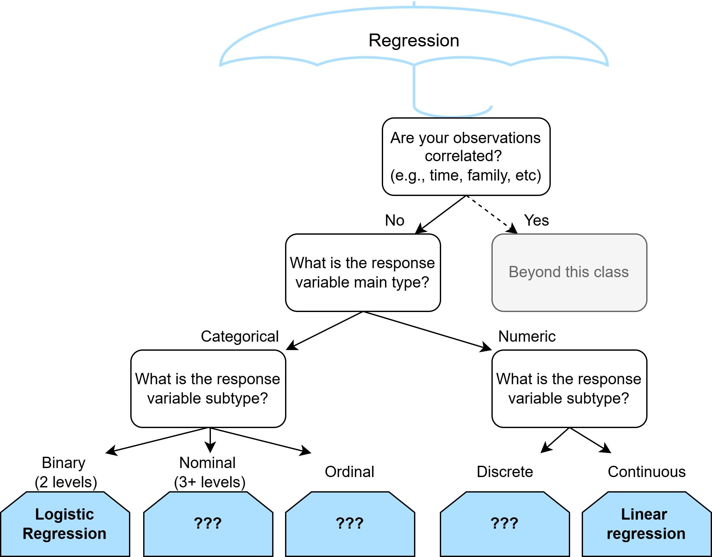
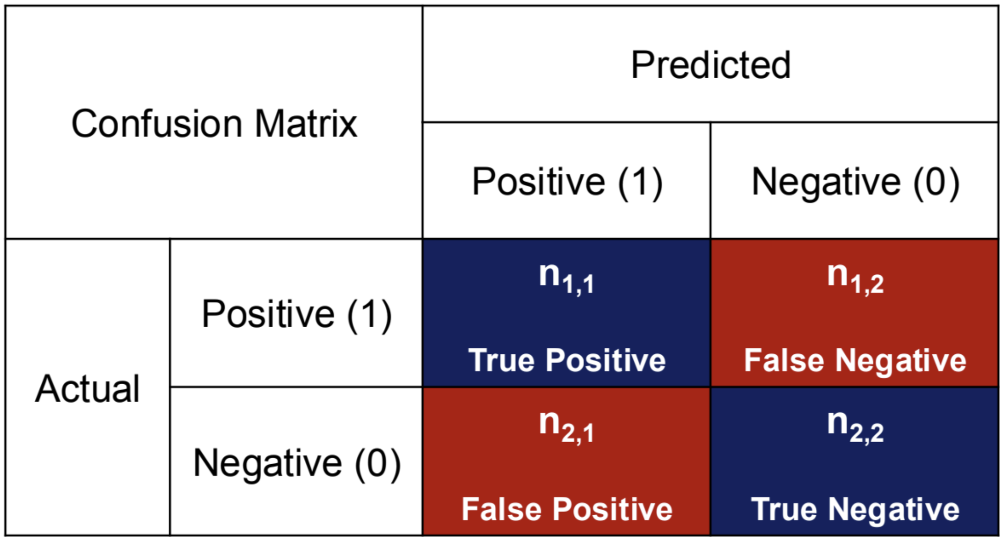
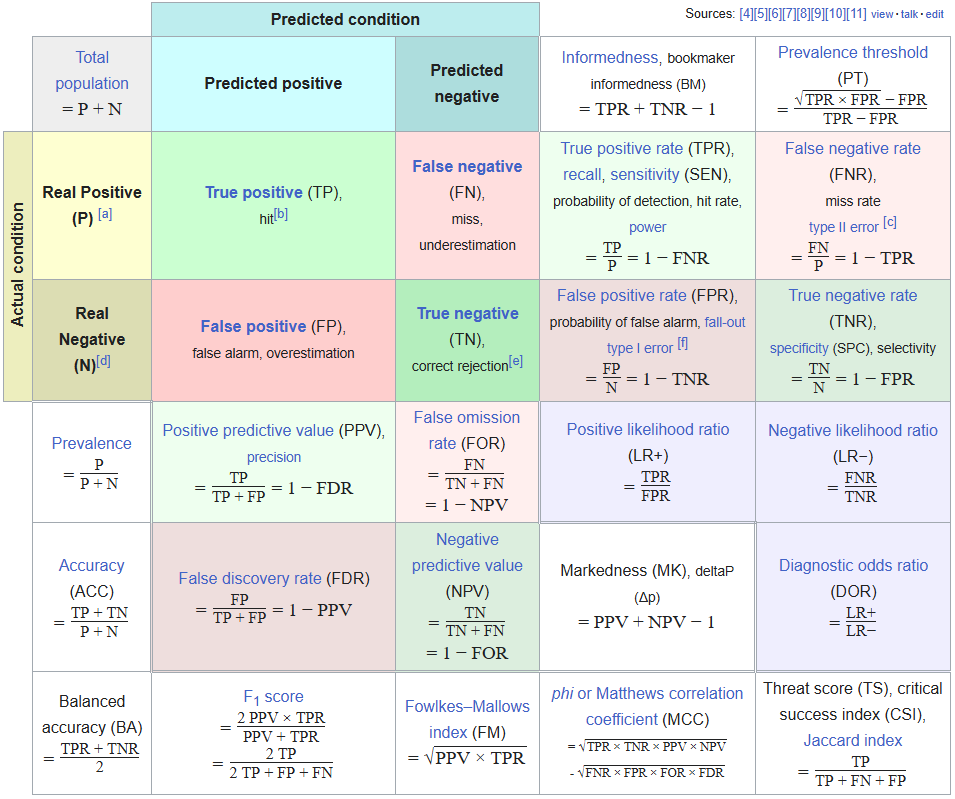

```{r}
#| echo: false

library(tidyverse)
library(janitor)
```

## 




# Prediction

How do we decide if our logistic model is predicting well?

## Confusion Matrix

{width=80% fig-align="center"}

## Confusion Matrix

\vspace*{0.5cm}

{width=100% fig-align="center"}


## Confusion Matrix: Sensitivity

1.) Sensitivity (= Recall, True Positive Rate)

\vspace*{0.75cm}

- TP + FN = # of actual ____________
- How well does the model classify/predict the positive value among the actual positive samples?
- How well does the model detect positive samples accurately?
- Example: Detecting spam emails
    - What percentage of spam emails does the model detect among the actual spam emails?
  
    
## Confusion Matrix: Specificity 

2.) Specificity (= Selectivity, True Negative Rate)

\vspace*{0.75cm}

- TN + FP = # of actual _______________
- How well does the model classify/predict the negative value among the actual negative samples?
- How well does the model eliminate negative samples accurately?
- Example: Detecting spam emails
    - What percentage of non-spam emails does the model detect among the actual non-spam emails?
    

## Confusion Matrix: Trade-off

3.) Trade-off between sensitivity and specificity

- "Best model" = high sensitivity \& high specificity $\rightarrow$ F1-score
- F1-score is bounded between 0 and 1

\begin{equation*}
  \begin{split}
    \text{F1-score} &= \frac{2}{Precision^{-1} + Recall^{-1}}\\
    &= \frac{2TP}{2TP + FP + FN}
  \end{split}
\end{equation*}

\vspace*{1cm}

## Recall the Coronary Heart Disease data

```{r}
heart_data <- read_csv(
  "https://hastie.su.domains/ElemStatLearn/datasets/SAheart.data", 
  show_col_types = FALSE
)

heart_model <- glm(
  chd ~ sbp + famhist + age,
  data = heart_data,
  family = binomial # This tells it to do logisitic regression
)
```


## Computing confusion matrix

First compute the predictions for each observation.
```{r}
predicted_probabilities <- predict(
  heart_model, 
  newdata = heart_data, 
  type = "response"
)

predicted_survival <- ifelse(predicted_probabilities > 0.5, yes = 1, no = 0) 
```

Next we compute the confusion matrix for our *in-sample predictions*, this is different from *out-of-sample predictions* where we would check our predictive performance on new data.

## Computing confusion matrix

```{r}
library(caret)

confusionMatrix(
  as.factor(predicted_survival), 
  as.factor(heart_data$chd)
)
```

## Computing F-1 score

```{r}
confusion_matrix <- confusionMatrix(
  as.factor(predicted_survival), 
  as.factor(heart_data$chd)
)

confusion_matrix$byClass["F1"]
```

## Are there other ways to define "best model"?

. . .

Maybe a few...

## 



##

When you encounter a new evaluation metric some good considerations are:

- What constitutes a "good score"? Is the score bounded?
- What is being valued? E.g., TP? FN?
- Does it match what I value in this context?
  - E.g., When predicting cancer maybe we are more concerned with _____
  - E.g., When predicting mechanical failure and considering hiring an additional mechanic in a warehouse we might be more concerned with ______

# Other models for binary classification

## Recall 

We chose the logistic function to link our expected response to our linear model

$$logistic(Z) = \frac{e^z}{1 + e^z}$$

$$E[Y_i | X_{1i}, ..., X_{pi}] = \frac{e^{\beta_0 + \beta_1 X_{1i} + ... + \beta_p X_{pi}}}{1 + e^{\beta_0 + \beta_1 X_{1i} + ... + \beta_p X_{pi}}}$$

. . .

$$log(\frac{E[Y_i | X_{1i}, ..., X_{pi}]}{1 - E[Y_i | X_{1i}, ..., X_{pi}]}) = \beta_0 + \beta_1 X_{1i} + ... + \beta_p X_{pi}$$

## Link 

We chose the logistic function to link our expected response to our linear model

$$E[Y_i | X_{1i}, ..., X_{pi}] = \frac{e^{\beta_0 + \beta_1 X_{1i} + ... + \beta_p X_{pi}}}{1 + e^{\beta_0 + \beta_1 X_{1i} + ... + \beta_p X_{pi}}}$$

. . .

We liked this **link function** because

- It was bounded between 0 and 1
- It results in odds interpretation for coefficients

. . .

What other link functions, aside from the logistic link, could we have used?

## Probit regression

One possible link function that is also bounded between 0 and 1 is the probit link

$$E[Y_i | X_{1i}, ..., X_{pi}] = \Phi(\beta_0 + \beta_1 X_{1i} + ... + \beta_p X_{pi}),$$

Where $\Phi( \cdot )$ is the cumulative standard normal distribution function.

. . .

Con: $\beta_j$ does not have a simple interpretation

##

```{r}
heart_logistic_model <- glm(
  chd ~ sbp + famhist + age,
  data = heart_data,
  family = binomial # This tells it to do logisitic regression by default
)

heart_probit_model <- glm(
  chd ~ sbp + famhist + age,
  data = heart_data,
  family = binomial(link = "probit") # This tells it to do probit regression
)
```

##

```{r}
summary(heart_probit_model)
```

##

```{r}
logistic_pi_predictions <- predict(heart_logistic_model, newdata = heart_data)
logistic_y_predictions <- ifelse(logistic_pi_predictions > 0.5, yes = 1, no = 0)

probit_pi_predictions <- predict(heart_probit_model, newdata = heart_data)
probit_y_predictions <- ifelse(probit_pi_predictions > 0.5, yes = 1, no = 0)
```

. . .


::::{.columns}

:::{.column width="50%"}

```{r}
confusionMatrix(
  as.factor(logistic_y_predictions), 
  as.factor(heart_data$chd)
)
```

:::

:::{.column width="50%"}

```{r}
confusionMatrix(
  as.factor(probit_y_predictions), 
  as.factor(heart_data$chd)
)
```

:::
::::


