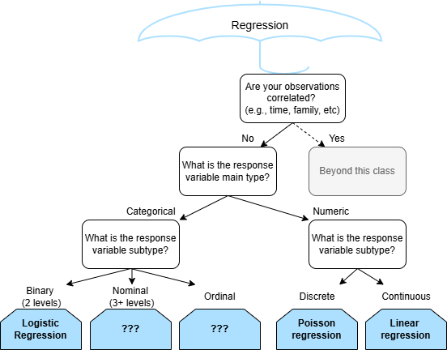

```{r}
#| echo: false

library(tidyverse)
library(janitor)

theme_set(theme_bw(base_size = 24))
```

## Data context

The Florida Museum of Natural History maintains the International Shark Attack File, a record of unprovoked shark attacks (and resultant fatalities) worldwide. 

Patterns in Florida are particularly interesting since the peninsular nature of the state means that almost all Florida residents and visitors are within 90 minutes of the Atlantic Ocean or Gulf of Mexico. 

Further, since population figures for Florida are available, it is possible to account for changes in coastal population by examining patterns in attack rates, rather than simply attack counts.

## Data

The shark data can be found in Simonoff's book [Analyzing Categorical Data](https://pages.stern.nyu.edu/~jsimonof/AnalCatData/). For our purposes we will assume that the observations are independent.

You can download the data from Canvas and learn more [here](https://www.floridamuseum.ufl.edu/shark-attacks/maps/na/usa/florida/)

```{r}
library(readxl)

shark_data <- read_xls("floridashark.xls")

glimpse(shark_data)
```


## Shark attacks

```{r}
ggplot(shark_data, aes(x = Year, y = Attacks)) +
  geom_point()
```


## Modeling considerations

What is the response variable?______________

What type of variable is the response?______________

*Is linear regression appropriate?*

. . .

Let's do it anyway and see what happens!

## Linear regression for shark attacks

```{r}
ggplot(shark_data, aes(x = Year, y = Attacks)) +
  geom_point() +
  geom_smooth(method = "lm", se = FALSE)
```

. . .

*Notice anything?*

## Linear regression for shark attacks

```{r}
linear_shark_model <- lm(
  Attacks ~ Year,
  data = shark_data
)

summary(linear_shark_model)
```

## Linear regression for shark attacks

Let's do prediction with our model! Predict expected number of attacks in 1980.

```{r}
new_data1 <- data.frame(Year = 1980)

predict(linear_shark_model, newdata = new_data1)
```

```{r}
#| echo: false

ggplot(shark_data, aes(x = Year, y = Attacks)) +
  geom_point() +
  geom_smooth(method = "lm", se = FALSE) +
  geom_point(
    data = new_data1 |> 
      mutate(Attacks = predict(linear_shark_model, newdata = new_data1)),
    aes(x = Year, y = Attacks),
    color = "red",
    size = 3
  )
```

## Linear regression for shark attacks

Let's do prediction with our model! Predict expected number of attacks in 1950.

```{r}
new_data2 <- data.frame(Year = 1950)

predict(linear_shark_model, newdata = new_data2)
```

```{r}
#| echo: false

ggplot(shark_data, aes(x = Year, y = Attacks)) +
  geom_point() +
  geom_smooth(method = "lm", se = FALSE) +
  geom_point(
    data = new_data2 |> 
      mutate(Attacks = predict(linear_shark_model, newdata = new_data2)),
    aes(x = Year, y = Attacks),
    color = "red",
    size = 3
  )
```


## Linear regression for shark attacks: takeaways

- As usual, the computer let us do incorrect things with no error!
- Just like with binary data, a linear model can give invalid predictions, since predictions from linear models range $(-\infty, \infty)$

. . .

*Any ideas of what to do?*

## Link functions

$$Y_i | X_{1i}, ..., X_{pi} \sim Normal(\mu_i, \sigma^2)$$

So $E[Y_i | X_{1i}, ..., X_{pi}] = \mu_i \in (-\infty, \infty)$.

. . .

Linear regression uses the "identity link":
$$E[Y_i | X_{1i}, ..., X_{pi}] = \beta_0 + \beta_1 X_{1i} + ... + \beta_p X_{pi},$$


## Link functions

$$Y_i | X_{1i}, ..., X_{pi} \sim Bernoulli(\pi_i)$$

. . .

So $E[Y_i | X_{1i}, ..., X_{pi}] = \pi_i \in [0, 1]$.

. . .

Logistic regression uses the "logistic link":
$$E[Y_i | X_{1i}, ..., X_{pi}] = \frac{e^{\beta_0 + \beta_1 X_{1i} + ... + \beta_p X_{pi}}}{1 + e^{\beta_0 + \beta_1 X_{1i} + ... + \beta_p X_{pi}}},$$


## Log link

$$Y_i | X_{1i}, ..., X_{pi} \sim Poisson(\lambda_i)$$

So $E[Y_i | X_{1i}, ..., X_{pi}] = \lambda_i \in (0, \infty)$.

. . .

We can use the "log link":
$$E[Y_i | X_{1i}, ..., X_{pi}] = \log\left(\beta_0 + \beta_1 X_{1i} + ... + \beta_p X_{pi}\right),$$

##




## Fitting poisson regression

```{r}
shark_poisson_model <- glm(
  Attacks ~ Year, 
  data = shark_data, 
  family = poisson
) 

summary(shark_poisson_model)
```

## Plotting poisson regression

```{r}
ggplot(shark_data, aes(x = Year, y = Attacks)) +
  geom_point() +
  geom_smooth(
    method = "glm", 
    se = FALSE, 
    method.args = list(family = "poisson")
  )
```

## Poisson regression for shark attacks

Let's do prediction with our model! Predict expected number of attacks in 1950.

```{r}
new_data2 <- data.frame(Year = 1950)

predict(shark_poisson_model, newdata = new_data2)
```

```{r}
#| echo: false

ggplot(shark_data, aes(x = Year, y = Attacks)) +
  geom_point() +
  geom_smooth(
    method = "glm", 
    se = FALSE, 
    method.args = list(family = "poisson")
  ) +
  geom_point(
    data = new_data2 |> 
      mutate(Attacks = predict(shark_poisson_model, newdata = new_data2, type = "response")),
    aes(x = Year, y = Attacks),
    color = "red",
    size = 3
  )
```

## Inference for Poisson regression

Wald and Likelihood Ratio work for Poisson regression too!

95% Confidence intervals
```{r}
confint(shark_poisson_model)
```

. . .

*What does $e^{\beta_1}$ mean in Poisson regression?*

## Recall $\beta_1$ in Logistic Regression

\begin{equation*}
  \begin{split}
    &\log(\frac{E[Y_i | X_i = x + 1]}{1 - E[Y_i | X_i = x + 1]}) - \log(\frac{E[Y_i | X_i = x]}{1 - E[Y_i | X_i = x]})\\
    &= \beta_0 + \beta_1 (x + 1) - \left(\beta_0 + \beta_1 x \right)\\
    &= \beta_0 + \beta_1x + \beta_1 - \beta_0 - \beta_1 x\\
    &= \beta_1.
  \end{split}
\end{equation*}

. . .

$\log(\frac{E[Y_i | X_i = x + 1]}{1 - E[Y_i | X_i = x + 1]}) - \log(\frac{E[Y_i | X_i = x]}{1 - E[Y_i | X_i = x]}) = \beta_1$

$\log(\frac{E[Y_i | X_i = x + 1]}{1 - E[Y_i | X_i = x + 1]} / \frac{E[Y_i | X_i = x]}{1 - E[Y_i | X_i = x]}) = \beta_1$

$e^{\beta_1} = \frac{E[Y_i | X_i = x + 1]}{1 - E[Y_i | X_i = x + 1]} / \frac{E[Y_i | X_i = x]}{1 - E[Y_i | X_i = x]}$

## Interpreting $\beta_1$ in Logistic Regression

$$e^{\beta_1} = \frac{E[Y_i | X_i = x + 1]}{1 - E[Y_i | X_i = x + 1]} / \frac{E[Y_i | X_i = x]}{1 - E[Y_i | X_i = x]}$$

So $\beta_1$ is the difference in log odds associated with a 1 unit increase in X.

. . .

So $e^{\beta_1}$ is the multiplicative change in odds (**odds ratio**) associated with a 1 unit increase in X.


##  $\beta_1$ in Poisson Regression

*Done in class*

##  $\beta_1$ in Poisson Regression

\begin{equation*}
  \begin{split}
    &\log(E[Y_i | X_i = x + 1]) - \log(E[Y_i | X_i = x])\\
    &= \beta_0 + \beta_1 (x + 1) - \left(\beta_0 + \beta_1 x \right)\\
    &= \beta_0 + \beta_1x + \beta_1 - \beta_0 - \beta_1 x\\
    &= \beta_1.
  \end{split}
\end{equation*}

. . .

\begin{equation*}
  \begin{split}
    &\log(E[Y_i | X_i = x + 1]) - \log(E[Y_i | X_i = x]) = \beta_1\\
    &\log(E[Y_i | X_i = x + 1] / E[Y_i | X_i = x]) = \beta_1\\
    &e^{\beta_1} = E[Y_i | X_i = x + 1] / E[Y_i | X_i = x]
  \end{split}
\end{equation*}

## Interpreting $\beta_1$ in Poisson Regression

So $\beta_1$ is the difference in log expected value associated with a one unit increase in X.

. . .

So $e^{\beta_1}$ is the multiplicative change in expected value (**Rate ratio**) associated with a one unit increase in X. 


## Interpreting $\beta_1$ in Poisson Regression in context

Our estimate for $\beta_1$ was `r round(shark_poisson_model$coefficients["Year"], digits = 2)`.

- For a one year increase we associate a difference in log mean/rate of `r round(shark_poisson_model$coefficients["Year"], digits = 2)` ($\beta_1$).

. . .

- For a one year increase we associate a multiplicative change in mean/rate of `r round(exp(shark_poisson_model$coefficients["Year"]), digits = 2)` ($e^{\beta_1}$).

## Transforming confidence interval

If we do want to interpret $e^{\beta_1}$ we can also transform the confidence interval to be in the same units.

95% confidence intervals for $\beta_0, \beta_1$:
```{r}
confint(shark_poisson_model)
```

95% confidence intervals for $e^{\beta_0}, e^{\beta_1}$:
```{r}
exp(confint(shark_poisson_model))
```

. . .

We could also do that for logisitic regression!


# Model evaluation

How do we know if we have a good model?

## Prediction

Linear regression:

- Residual Square Error / Root Mean Squared Error $\in [0, \infty)$ (the lower the better)

. . .

Logistic regression:

- Accuracy, Sensitivity, Specificity, F1-score, ...

. . .

Poisson regression:

- Deviance residuals $\in [0, \infty)$ (the lower the better), ...

## Inference

::::{.columns}

:::{.column width="50%"}
Linear regression:

- $R^2$ or Adjusted $R^2$


Logistic regression:

- Deviance (for large $n$)!


Poisson regression:

- Deviance! (for large $n$)!

:::

:::{.column width="50%"}

*Note we are in the realm of many possibilities, there is a lot we don't have time to cover in this class, but there are more options.*

:::
::::

## Deviance

**Deviance** intuitively measures the deviation of the fitted logistic model with respect to the "perfect" fitted model.

*We won't go into detail of the math behind this measurement.*

. . .

With large $n$, $Deviance \sim \chi^2$

We can use the p-value of this statistic:

- small p-value indicates lack-of-fit of model to data
- large p-value indicated no evidence of a lack-of-fit

##

Deviance of our Poisson shark model

```{r}
1 - pchisq(deviance(shark_poisson_model), df = shark_poisson_model$df.residual)
```

This indicates evidence of a lack of fit of our model to our data.

. . .

Three main explanations for "lack-of-fit":

1. We may be missing important covariates or transformations of our covariates.
2. There may be extreme observations that cause deviance to be larger.
3. We may have overdispersion.

## Lack-of-fit Option 1

It is not exactly fair to compare years here because there may be different population levels, especially comparing years far apart.

- Naturally, as there are more people there is higher potential for shark encounters.

- When we want to control for varying opportunities we can include an **offset** in Poisson regression.

*Note there are other problems with this model, but we will focus on this potential one.*

## Offsets in Poisson

Without offset:
$$\log(E[\text{Shark attacks}_i | X_i]) = \beta_0 + \beta_1 Year_i$$

With offset:
$$\log(E[\frac{\text{Shark attacks}_i}{ \text{Population}_i} | X_i]) = \beta_0 + \beta_1 Year_i$$
\begin{equation*}
  \begin{split}
    \rightarrow \log(\text{Shark attacks}_i | X_i]) &= \beta_0 + \log(\text{Population}_i)\\
  &+ \beta_1 Year_i
  \end{split}
\end{equation*}

## Shark model with offset

```{r}
shark_poisson_model2 <- glm(
  Attacks ~ Year, 
  data = shark_data, 
  family = poisson,
  offset = log(Population)
) 

summary(shark_poisson_model2)
```

## Shark model with offset

Notice there was no additional coefficient estimated. The offset is considered a known value.

. . .

```{r}
1 - pchisq(deviance(shark_poisson_model2), df = shark_poisson_model2$df.residual)
```

Still we find evidence of a lack-of-fit of our model.

## Overdispersion

With the Poisson distribution $E[Z] = Var(Z) = \lambda$ for $Z \sim Poisson(\lambda)$

**Overdispersion** is when $E[Z] < Var(Z)$

. . .

Consequences:

- Underestimated Standard Errors: CI's are narrower than they should be
- Biased p-values: more likely to incorrectly reject the $H_0$ 

## Overdispersion

Solution is **QuasiPoisson regression** 

- Less theoretically sound, but it accounts for increase in variance

```{r}
shark_poisson_model3 <- glm(
  Attacks ~ Year, 
  data = shark_data, 
  family = quasipoisson, # Change
  offset = log(Population)
) 

summary(shark_poisson_model3)
```

