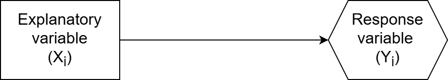
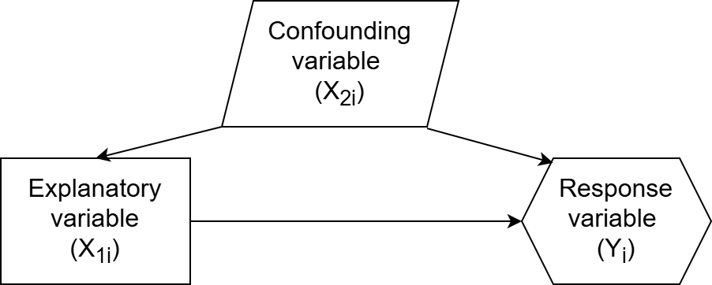
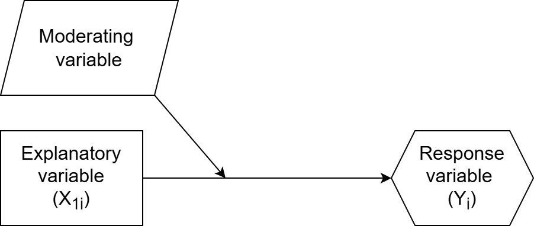
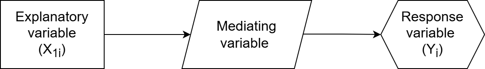
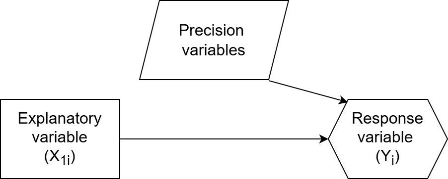

## Variable types

We have learned about several different types of variables

There are some we haven't named and some we haven't discussed

## Variables of primary interest

In experimental design our outcome of interest is our *response variable*, and our primary variable we think explains this variable is the *explanatory variable*.

Example: Sleep quality ($X_{1i}$) affects academic achievement ($Y_{i}$)

## Variables of primary interest: what to do

- Choose a model appropriate for your what type of variable your response variable is
- Incorporate the explanatory variable as an $X_i$

## Confounding variables

- Are related to both the explanatory and response variable

Example: Stressful home environment can affect sleep quality and academic achievement

## Confounding variables: what to do

- are controlled for in experiments where there is random assignment of the explanatory variable / treatment
- need to be accounted for in observational studies (as an $X_i$)

## Moderating variables

- Explain the strength or direction of the relationship between the explanatory and response variable

Example: The relationship between sleep quality and academic achievement probably differs for children versus adults.

## Moderating variables: what to do

- Account for with an interaction between the moderating and explanatory variable

## Mediating variables

- explain the process or mechanism of the relationship between the explanatory and response variables

Example: Sleep quality affects academic achievement through the mediator of alertness ($X_{2i}$)

## Mediating variables: what to do

- Should not be controlled for (added to model) because we would lose the relationship between $X$ and $Y$

## Precision variables

- Variables only related to response variable and not explanatory

## Precision variables: what to do

- Consider adding them to increase precision (reduce variable) of our estimates, if they are highly related to response variable

## Practice

Reconsider your practical 2

